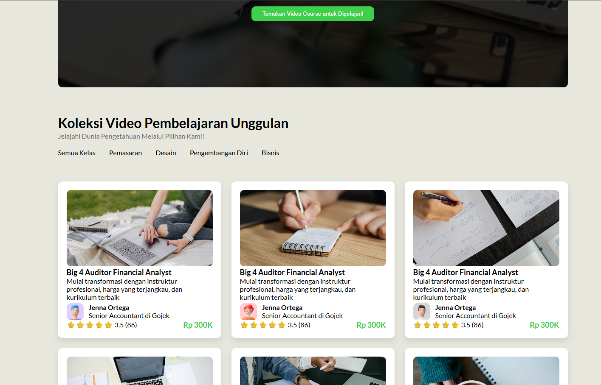
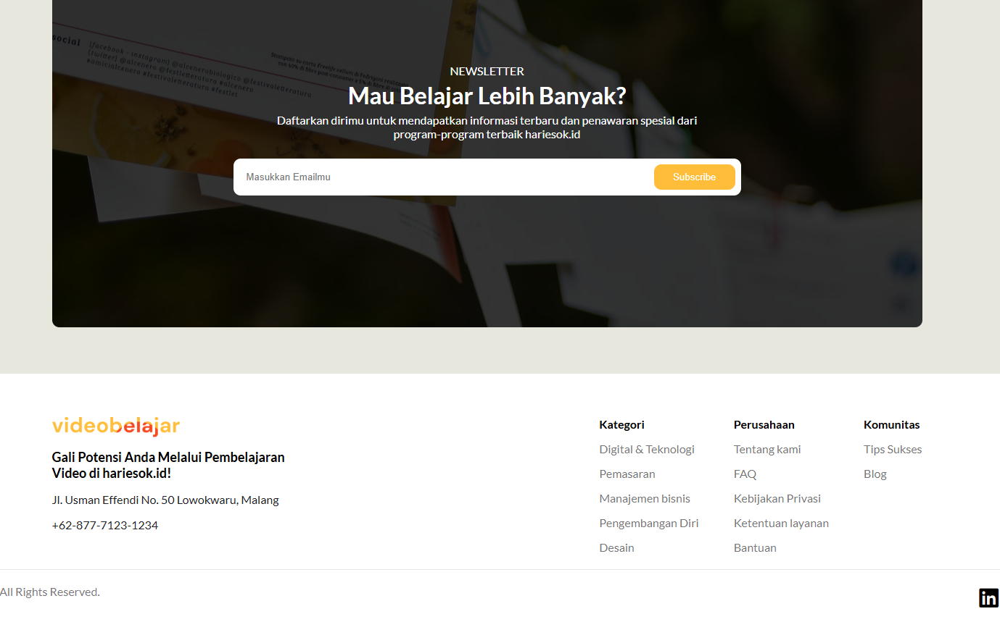
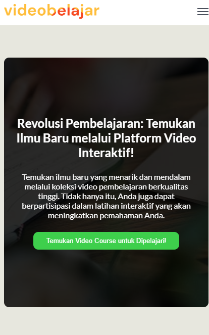
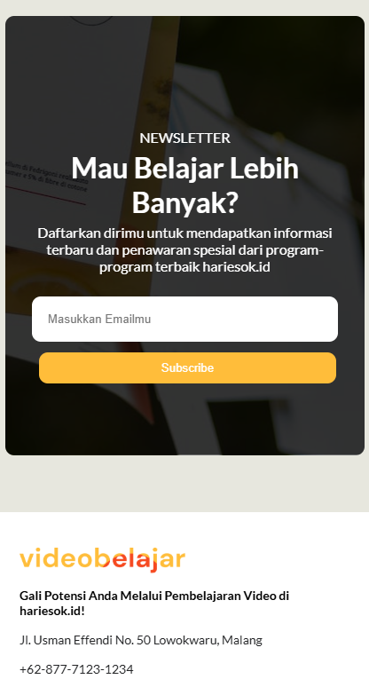

# Mission 3A Harisenin.com - Landing Page

Tugas Mission 3A untuk membuat sebuah Landing Page responsif menggunakan HTML5, Vanilla CSS, dan Javascript interaktif tanpa bantuan framework eksternal.

## 🚀 Fitur Utama
- **Multi-page:** Memiliki halaman utama (`index.html`), halaman masuk (`login.html`), dan halaman daftar (`register.html`).
- **Responsive Mobile Menu:** Fitur menu hamburger interaktif yang berfungsi dengan baik pada tampilan mobile.
- **Pure HTML & Vanilla CSS:** Layouting tanpa menggunakan framework CSS seperti Bootstrap atau Tailwind.

## 📸 Tampilan Proyek

### Tampilan Desktop & Mobile







## 🛠️ Teknologi yang Digunakan
- **HTML5:** Struktur halaman dan elemen semantik.
- **Vanilla CSS3:** Styling, tata letak (Flexbox/Grid), dan desain responsif.
- **Vanilla JavaScript:** Logika interaktif untuk memicu menu navigasi mobile (`active` class toggle).

## 📂 Struktur Folder
Berdasarkan struktur repositori saat ini:
```text
├── asset/
│   └──                   # seluruh asset web
├── index.html            # Halaman utama / Landing page
├── login.html            # Halaman masuk (Login)
├── register.html         # Halaman pendaftaran (Register)
└── style.css             # File stylesheet utama
```

## 💻 Cara Menjalankan Proyek secara Lokal
1. Pastikan seluruh file di atas berada dalam satu folder yang sama.
2. Klik dua kali pada file `index.html` untuk membukanya di browser Anda.
3. Anda juga dapat menggunakan ekstensi **Live Server** di VS Code untuk melihat perubahan secara langsung saat mengedit kode.
